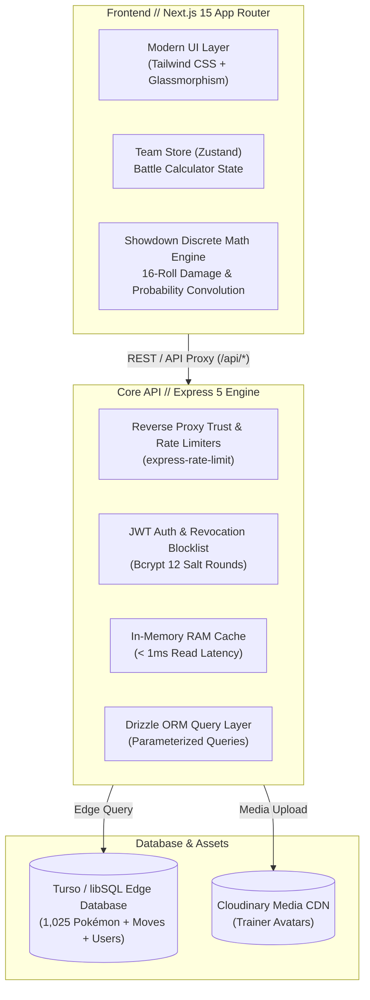

# ProtoDex // プロトデックス
### Tournament-Grade Competitive Pokédex & Battle Simulation Studio
#### 大会基準・対戦考察特化型 全国ポケモン図鑑 ＆ チームビルダースタジオ

[](https://www.typescriptlang.org/)
[](https://nextjs.org/)
[](https://tailwindcss.com/)
[](https://orm.drizzle.team/)
[](https://turso.tech/)
[](https://sentry.io/)

---

## 1. Executive Summary // 概要

**ProtoDex** is a high-performance web platform combining an authoritative 1,025-Pokémon National Pokédex with a tournament-grade competitive damage calculator and team composition studio. Engineered under modern Japanese software design philosophy (*Monozukuri* — ものづくり), it features strict end-to-end TypeScript safety, sub-millisecond in-memory caching, discrete probability battle mathematics, and dual-theme typographic tokens optimized for competitive analysts and collectors.

---

## 2. System Architecture // システム設計



---

## 3. Competitive Battle Engine & Mathematical Rigor // 対戦計算エンジン

ProtoDex implements official Generation IX Pokémon Showdown battle calculation mechanics with discrete probability distributions.

### 3.1 Discrete 16-Roll Damage Variance
Damage output is calculated using the official 16-roll random integer interval:
$$\text{Damage}(R) = \left\lfloor \left( \frac{\left\lfloor \frac{2 \cdot \text{Level}}{5} + 2 \right\rfloor \cdot \text{Power} \cdot \frac{A}{D}}{50} + 2 \right) \cdot \text{Modifier} \cdot \frac{R}{100} \right\rfloor$$
where $R \in \{85, 86, 87, \dots, 100\}$, and $\text{Modifier}$ combines STAB ($1.5\times$ or $2.0\times$ Adaptability), Type Effectiveness ($\{0, 0.25, 0.5, 1, 2, 4\}$), Weather, Critical Hits ($1.5\times$), and Held Item multipliers.

### 3.2 2HKO & OHKO Probability Convolution
Unlike naive average damage approximations, ProtoDex calculates exact kill probabilities via discrete probability convolution across two consecutive turns:
$$P(\text{2HKO}) = \frac{1}{256} \sum_{r_1=85}^{100} \sum_{r_2=85}^{100} \mathbf{1}_{\{ \text{Damage}(r_1) + \text{Damage}(r_2) \ge \text{Target HP} \}}$$

### 3.3 Dynamic Defense & Speed Ruler
- **Effective Bulk Matrix**: Visualizes physical and special durability factoring in base HP, defensive investment (EVs/IVs), nature multipliers, and dynamic stat stages $[-6, +6]$.
- **Speed Tier Ruler**: Dynamically plots Choice Scarf, Booster Energy (Protosynthesis / Quark Drive), Tailwind, and weather speed boosts against the standard meta speed spectrum.

---

## 4. Key Systems & Modules // 主要機能

| Module | Location | Description |
| :--- | :--- | :--- |
| **National Pokédex** | `/pokedex` | Instant searching across 1,025 species with 18-type matrix filtering and generation tabs. |
| **Detail Dossier** | `/pokemon/[name]` | Comprehensive breakdown of base stats, movesets, abilities, full evolutionary trees (including branched evolutions), and historical game lore. |
| **Team Builder Studio** | `/builder` | 6-member tournament roster builder featuring type weakness heatmaps, defensive switching synergy network, and tactical role radar. |
| **Damage Calculator Drawer** | Modal Drawer | Full competitive damage simulation drawer with move selection, stat stage controls, and 16-roll damage histograms. |
| **Trainer Profile & Progress** | `/profile` | Synchronized collection tracking for caught Pokémon, priority bookmarks, avatar upload, and JSON data export/import. |

---

## 5. Security & Authentication Architecture // セキュリティ仕様

- **Password Hashing**: Bcrypt with **12 salt rounds** to prevent brute-force rainbow table attacks.
- **Dual-Layer Token Persistence**: Secure `httpOnly`, `sameSite: lax/none`, `secure` cookie authentication paired with client Authorization Header fallback for seamless cross-origin communication.
- **Immediate Revocation**: In-memory token revocation blocklist enabling instant session invalidation on logout or security events.
- **Rate Limiting**: Multi-tiered protection utilizing `express-rate-limit`:
  - Public authentication (`/api/auth`): 10 requests / 15 min.
  - User mutations (`/api/user`): 60 requests / 15 min.
  - General API endpoints: 200 requests / 15 min.
- **Validation**: Strict runtime payload verification powered by **Zod** schema guards.
- **SQL Injection Immunity**: 100% parameterized queries generated via **Drizzle ORM**.

---

## 6. Japanese Typographic & Linguistic Standards // 専門用語標準

In adherence to official Game Freak and The Pokémon Company Japanese UI standards, all interface terminology reflects authentic competitive usage:

| Feature / Concept | Standard English | ProtoDex Official Japanese |
| :--- | :--- | :--- |
| **National Pokédex** | National Dex | **全国図鑑** |
| **Favorites / Saved** | Bookmarks / Saved | **お気に入り** |
| **Team Builder** | Team Builder | **チーム編成** |
| **Trainer Profile** | Trainer Account | **トレーナー情報** |
| **Catalog Count** | Full Catalog | **1,025匹 収録** / **全ポケモン収録** |

---

## 7. Local Development & Setup // 開発環境構築

### Prerequisites
- Node.js >= 18.x
- npm or pnpm

### Frontend Setup
```bash
cd prototype-dex
npm install
npm run dev
# Running on http://localhost:3000
```

### Backend Setup
```bash
cd prototype-dex-backend
npm install
npm run dev
# Running on http://localhost:5000
```

### Code Quality Verification
```bash
# TypeScript strict typecheck
npx tsc --noEmit

# ESLint static analysis
npm run lint
```

---

## 8. License // ライセンス
Distributed under the ISC License. All Pokémon assets and intellectual property belong to Nintendo, Game Freak, and Creatures Inc.
